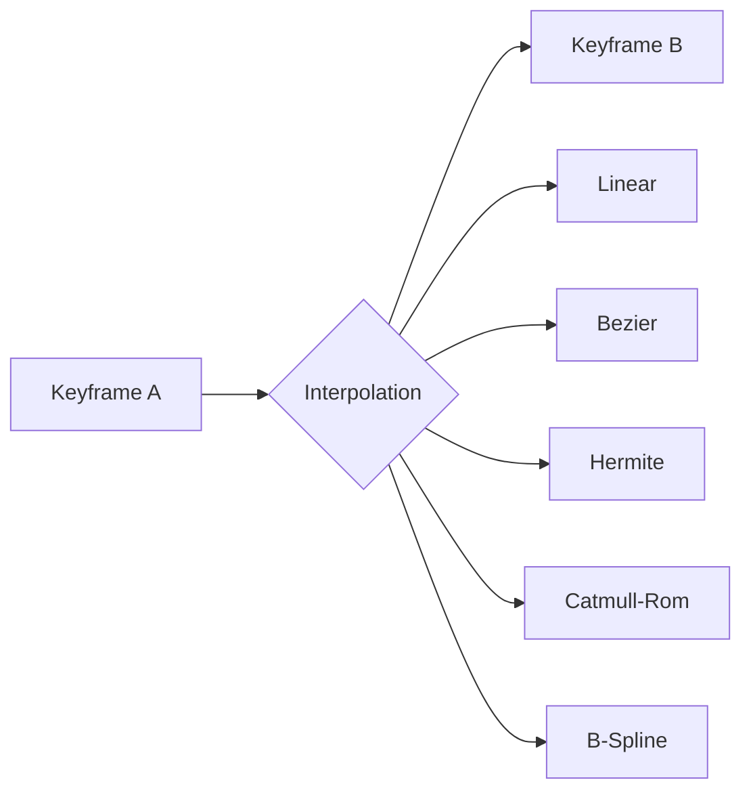

# Advanced Animation Interpolation Techniques

**Research Date:** 2025-01-06  
**Purpose:** Comprehensive guide for motion graphics speed variations

---

## Interpolation Methods Overview



---

## 1. Linear Interpolation (Lerp)

**Simplest form.** Constant speed, no acceleration.

```python
def lerp(a, b, t):
    """Linear interpolation: t in [0,1]"""
    return a + (b - a) * t
```

**Use:** Mechanical movements, progress bars, timers.

---

## 2. Bezier Curves

**Industry standard** for animation. Controlled by 4 points: P0, P1, P2, P3.

### Types

| Type | Control Points | Character |
|------|----------------|-----------|
| **Linear** | (0,0) (1,1) | Constant speed |
| **Ease** | (0.25, 0.1) (0.25, 1) | Gentle start/end |
| **Ease-In** | (0.42, 0) (1, 1) | Slow start, fast end |
| **Ease-Out** | (0, 0) (0.58, 1) | Fast start, slow end |
| **Ease-In-Out** | (0.42, 0) (0.58, 1) | Slow-fast-slow |

### Advanced Presets (CSS/Motion)

```python
# Popular Bezier Presets (x1, y1, x2, y2)
PRESETS = {
    # Smooth
    "ease": (0.25, 0.1, 0.25, 1.0),
    "ease-in": (0.42, 0, 1.0, 1.0),
    "ease-out": (0, 0, 0.58, 1.0),
    "ease-in-out": (0.42, 0, 0.58, 1.0),
    
    # Aggressive
    "ease-in-quad": (0.55, 0.085, 0.68, 0.53),
    "ease-out-quad": (0.25, 0.46, 0.45, 0.94),
    "ease-in-out-quad": (0.455, 0.03, 0.515, 0.955),
    
    # Cubic (More dramatic)
    "ease-in-cubic": (0.55, 0.055, 0.675, 0.19),
    "ease-out-cubic": (0.215, 0.61, 0.355, 1.0),
    "ease-in-out-cubic": (0.645, 0.045, 0.355, 1.0),
    
    # Quart (Even stronger)
    "ease-in-quart": (0.895, 0.03, 0.685, 0.22),
    "ease-out-quart": (0.165, 0.84, 0.44, 1.0),
    
    # Expo (Exponential - very dramatic)
    "ease-in-expo": (0.95, 0.05, 0.795, 0.035),
    "ease-out-expo": (0.19, 1.0, 0.22, 1.0),
    
    # Back (Overshoot effect)
    "ease-in-back": (0.6, -0.28, 0.735, 0.045),
    "ease-out-back": (0.175, 0.885, 0.32, 1.275),
    
    # Elastic (Spring bounce)
    # Cannot be represented as cubic bezier - needs custom function
}
```

### Implementation

```python
def cubic_bezier(t, x1, y1, x2, y2):
    """Approximate cubic bezier easing."""
    # Newton-Raphson to solve for x
    cx = 3.0 * x1
    bx = 3.0 * (x2 - x1) - cx
    ax = 1.0 - cx - bx
    
    cy = 3.0 * y1
    by = 3.0 * (y2 - y1) - cy
    ay = 1.0 - cy - by
    
    def solve_x(t):
        return ((ax * t + bx) * t + cx) * t
    
    def solve_y(t):
        return ((ay * t + by) * t + cy) * t
    
    # Binary search for t given x
    epsilon = 1e-6
    t_guess = t
    for _ in range(8):
        x = solve_x(t_guess) - t
        if abs(x) < epsilon:
            break
        dx = (3.0 * ax * t_guess + 2.0 * bx) * t_guess + cx
        t_guess -= x / dx
    
    return solve_y(t_guess)
```

---

## 3. Hermite Splines

**Defines curves using positions AND tangents** at each keyframe.

```
P(t) = h00(t)·P0 + h10(t)·m0 + h01(t)·P1 + h11(t)·m1

Where:
- h00(t) = 2t³ - 3t² + 1
- h10(t) = t³ - 2t² + t  
- h01(t) = -2t³ + 3t²
- h11(t) = t³ - t²
```

**Use:** When you need precise control over entry/exit tangents.

```python
def hermite(t, p0, p1, m0, m1):
    """
    Hermite interpolation.
    p0, p1: Start/end positions
    m0, m1: Start/end tangents (velocities)
    """
    t2 = t * t
    t3 = t2 * t
    
    h00 = 2*t3 - 3*t2 + 1
    h10 = t3 - 2*t2 + t
    h01 = -2*t3 + 3*t2
    h11 = t3 - t2
    
    return h00*p0 + h10*m0 + h01*p1 + h11*m1
```

---

## 4. Catmull-Rom Splines ⭐

**The go-to for smooth keyframe interpolation.** Automatically calculates tangents.

> **"Catmull-Rom splines are frequently used to get smooth interpolated motion between key frames"** - Wikipedia

### Advantages
- Passes through ALL control points
- Tangents auto-calculated from neighbors
- C1 continuity (smooth velocity)

### Variants

| Type | Parameter α | Character |
|------|-------------|-----------|
| **Uniform** | α = 0 | May create loops |
| **Chordal** | α = 1 | Follows chord length |
| **Centripetal** | α = 0.5 | **Best quality - no cusps** |

### Implementation (Centripetal)

```python
import math

def catmull_rom(t, p0, p1, p2, p3, alpha=0.5):
    """
    Centripetal Catmull-Rom spline (recommended).
    Interpolates between p1 and p2.
    p0, p1, p2, p3: Four control points
    alpha: 0=uniform, 0.5=centripetal, 1=chordal
    """
    def tj(ti, pi, pj):
        dx = pj - pi
        return ti + abs(dx) ** alpha
    
    t0 = 0
    t1 = tj(t0, p0, p1)
    t2 = tj(t1, p1, p2)
    t3 = tj(t2, p2, p3)
    
    # Remap t to [t1, t2]
    t_scaled = t1 + t * (t2 - t1)
    
    A1 = (t1 - t_scaled)/(t1 - t0)*p0 + (t_scaled - t0)/(t1 - t0)*p1
    A2 = (t2 - t_scaled)/(t2 - t1)*p1 + (t_scaled - t1)/(t2 - t1)*p2
    A3 = (t3 - t_scaled)/(t3 - t2)*p2 + (t_scaled - t2)/(t3 - t2)*p3
    
    B1 = (t2 - t_scaled)/(t2 - t0)*A1 + (t_scaled - t0)/(t2 - t0)*A2
    B2 = (t3 - t_scaled)/(t3 - t1)*A2 + (t_scaled - t1)/(t3 - t1)*A3
    
    C = (t2 - t_scaled)/(t2 - t1)*B1 + (t_scaled - t1)/(t2 - t1)*B2
    
    return C
```

---

## 5. Special Effects Easing

### Bounce

```python
def ease_out_bounce(t):
    n1 = 7.5625
    d1 = 2.75
    
    if t < 1/d1:
        return n1 * t * t
    elif t < 2/d1:
        t -= 1.5/d1
        return n1 * t * t + 0.75
    elif t < 2.5/d1:
        t -= 2.25/d1
        return n1 * t * t + 0.9375
    else:
        t -= 2.625/d1
        return n1 * t * t + 0.984375
```

### Elastic (Spring)

```python
import math

def ease_out_elastic(t):
    c4 = (2 * math.pi) / 3
    
    if t == 0:
        return 0
    if t == 1:
        return 1
    
    return 2**(-10*t) * math.sin((t*10 - 0.75) * c4) + 1
```

### Back (Overshoot)

```python
def ease_out_back(t):
    c1 = 1.70158
    c3 = c1 + 1
    
    return 1 + c3 * (t - 1)**3 + c1 * (t - 1)**2
```

---

## Comparison Chart

```
Time →
┌─────────────────────────────────────────┐
│ Linear:     ──────────────────────────  │
│ Ease-Out:   ════════════──────────────  │ (fast start)
│ Ease-In:    ──────────────════════════  │ (fast end)
│ Ease-In-Out: ────════════════════────── │ (smooth)
│ Elastic:    ═══~~~~~═════════════════  │ (bounce)
│ Back:       ═══⟵═══════════════════⟶═ │ (overshoot)
└─────────────────────────────────────────┘
```

---

## Recommended for brush_reveal_test_002

| Object | Interpolation | Why |
|--------|---------------|-----|
| **Green** | `ease-in-out-cubic` | Dramatic, cinematic reveal |
| **Yellow** | `ease-out-expo` | Snappy, responsive |
| **Magenta** | `ease-out-back` | Playful overshoot accent |

---

## Sources

- [Cubic Hermite Spline - Wikipedia](https://en.wikipedia.org/wiki/Cubic_Hermite_spline)
- [Catmull-Rom Splines - Habrador](https://www.habrador.com/tutorials/interpolation/1-catmull-rom-splines/)
- [Bezier to Catmull-Rom Conversion](https://link.springer.com/article/10.1007/s42979-021-00770-x)
- [CMSC427 Parametric Curves](https://www.cs.umd.edu/~reastman/slides/L19P01ParametricCurves.pdf)
- [Drexel CS536 Hermite/Catmull-Rom](https://www.cs.drexel.edu/~deb39/Classes/CS536/Lectures/L-04_Hermite_Catmull_Rom.pdf)
