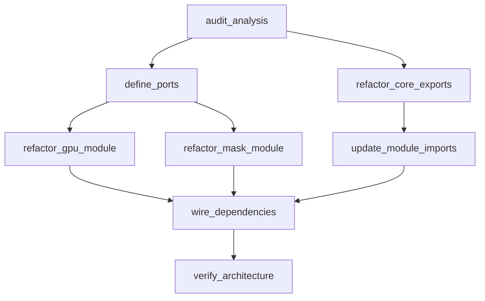

# Refactoring Plan: Hexagonal Architecture Compliance

**Generated:** 2026-01-06
**Goal:** Align `engine/src/domain` with strict Hexagonal Architecture rules (Agnostic Modules, Core Gateway).

## 1. Computational Analysis
- **Total Tasks:** 8
- **Critical Path:** Audit -> Ports -> Refactor Modules -> Wiring -> Verification
- **Estimated Complexity:** 20 points

## 2. Task Dependency Graph

## 3. Execution Order
1. **audit_analysis** (Architect)
2. **refactor_core_exports** (RefactoringSpecialist)
3. **define_ports** (RefactoringSpecialist)
4. **update_module_imports** (RefactoringSpecialist)
5. **refactor_gpu_module** (RefactoringSpecialist)
6. **refactor_mask_module** (RefactoringSpecialist)
7. **wire_dependencies** (Architect)
8. **verify_architecture** (QA)
