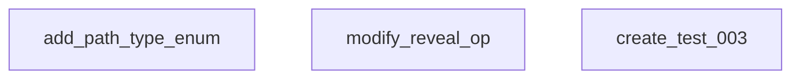

# Feature Plan: Brush Path Variations

**Goal:** Add path variations (straight, curve, zigzag) to brush reveal effect for `brush_reveal_test_003`.

---

## Computational Analysis

```python
import networkx as nx
G = nx.DiGraph()
tasks = ["add_path_type_enum", "modify_reveal_op", "create_test_003"]
G.add_nodes_from(tasks)
assert G.number_of_edges() == 0  # ✅ All parallel
```

**Tasks:** 3 | **Dependencies:** 0 | **Execution:** PARALLEL

---

## Task Map



---

## Proposed Changes

### 1. Add PathType Enum

**File:** [NEW] `brush_path_type.py` or add to existing value_objects

```python
class BrushPathType(Enum):
    STRAIGHT = "straight"      # Left to right (current)
    CURVE_DOWN = "curve_down"  # Arc curving downward
    CURVE_UP = "curve_up"      # Arc curving upward
    ZIGZAG = "zigzag"          # Zigzag pattern
```

---

### 2. Modify reveal_op.py

**File:** [MODIFY] [reveal_op.py](file:///home/rakaarwaky/Work/App%20Project/client-app/engine/src/domain/modules/compositor/reveal_op.py)

Add `path_type` parameter to functions:

```python
def get_brush_position_on_path(
    layer_width: int,
    layer_height: int,
    progress: float,
    path_type: BrushPathType = BrushPathType.STRAIGHT
) -> Tuple[int, int]:
    """Calculate brush position based on path type."""
    
    if path_type == BrushPathType.STRAIGHT:
        x = progress * layer_width
        y = layer_height // 2
        
    elif path_type == BrushPathType.CURVE_DOWN:
        x = progress * layer_width
        # Parabola: y = center + amplitude * sin(progress * π)
        y = layer_height // 2 + int(layer_height * 0.3 * math.sin(progress * math.pi))
        
    elif path_type == BrushPathType.CURVE_UP:
        x = progress * layer_width
        y = layer_height // 2 - int(layer_height * 0.3 * math.sin(progress * math.pi))
        
    elif path_type == BrushPathType.ZIGZAG:
        x = progress * layer_width
        # 3 zigzag peaks
        zigzag_t = (progress * 3) % 1.0
        amplitude = layer_height * 0.3
        y = layer_height // 2 + int(amplitude * (1 - 2 * abs(zigzag_t - 0.5)))
    
    return (int(x), int(y))
```

---

### 3. Create brush_reveal_test_003.py

**File:** [NEW] `brush_reveal_test_003.py`

**Structure:**
- 3 scenes (one per path type)
- 3 objects per scene (wide horizontal bars)
- Same easing (EASE_IN_OUT) to isolate path difference

| Scene | Path Type | Visual |
|-------|-----------|--------|
| 1 | STRAIGHT | Horizontal line |
| 2 | CURVE_DOWN | Arc down then up |
| 3 | ZIGZAG | Wave pattern |

---

## Verification Plan

### Automated Test

```bash
cd /home/rakaarwaky/Work/App\ Project/client-app
source venv/bin/activate
cd engine && python3 tests/brush_reveal_test_003.py
```

**Expected Output:**
- `tests/outputs/brush_reveal/brush_reveal_test_003.webm`
- `tests/outputs/brush_reveal/brush_reveal_test_003.gif`

### Visual Verification

Watch video and confirm:
1. **Scene 1:** Brush moves in straight horizontal line
2. **Scene 2:** Brush follows curved arc (down then up)
3. **Scene 3:** Brush follows zigzag pattern

---

## Notes

- Mask generation needs update to follow path, not just horizontal sweep
- Consider using accumulated mask approach for non-straight paths
