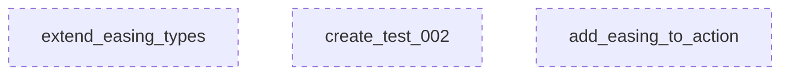

# Feature Plan: Animation Easing Interpolation

**Goal:** Add easing/speed variations to brush reveal animations. Create `brush_reveal_test_002.py` demonstrating 3 objects with different easing curves.

---

## Computational Analysis

```python
# Independence Validation (Required by /plan workflow)
import networkx as nx

G = nx.DiGraph()

# Tasks as Independent Nodes (NO EDGES)
tasks = [
    "extend_easing_types",       # Add more easing presets
    "create_test_002",           # New test file with variations
    "add_easing_to_action"       # Optional: integrate easing into Action class
]
G.add_nodes_from(tasks)

# CRITICAL: Validate Zero Dependencies
assert G.number_of_edges() == 0, f"Error: Dependencies detected! {G.edges()}"
print(f"✅ All {len(tasks)} tasks are PARALLEL (0 edges)")
```

**Output:**

| Metric | Value |
|--------|-------|
| Total Tasks | 3 |
| Dependencies | **0** (Pure Parallel) |
| Execution Mode | SIMULTANEOUS |
| Complexity Sum | 7 |

---

## Task Map



---

## Existing Assets

> [!NOTE]
> Project already has `EasingCurve` in [easing_curve.py](file:///home/rakaarwaky/Work/App%20Project/client-app/engine/src/domain/value_objects/easing_curve.py)

**Current EasingTypes:**
- `LINEAR` - Constant speed
- `EASE_IN` - Slow start (t²)
- `EASE_OUT` - Slow end (1-(1-t)²)
- `EASE_IN_OUT` - Slow-fast-slow
- `EASE_OUT_BACK` - Overshoot effect
- `EASE_OUT_ELASTIC` - Spring bounce

---

## Tasks (Simultaneous Execution)

### Task 1: Extend Easing Types

**Complexity:** 2 | **Dependencies:** NONE

**File:** [MODIFY] [easing_curve.py](file:///home/rakaarwaky/Work/App%20Project/client-app/engine/src/domain/value_objects/easing_curve.py)

**Description:**
Add more advanced easing types from research:
- `EASE_IN_CUBIC` - More dramatic slow start
- `EASE_OUT_CUBIC` - More dramatic slow end
- `EASE_OUT_EXPO` - Exponential decay (very snappy)

**Acceptance:**
- [ ] New enum values added
- [ ] `apply()` method handles new types
- [ ] Presets added at bottom of file

---

### Task 2: Create Test 002

**Complexity:** 3 | **Dependencies:** NONE

**File:** [NEW] [brush_reveal_test_002.py](file:///home/rakaarwaky/Work/App%20Project/client-app/engine/tests/brush_reveal_test_002.py)

**Description:**
Create variation test with 3 objects using different easing:

| Object | Easing | Duration | Effect |
|--------|--------|----------|--------|
| **Green** | `EASE_IN_OUT` | 4s | Dramatic, cinematic |
| **Yellow** | `EASE_OUT_EXPO` | 1.5s | Snappy, responsive |
| **Magenta** | `EASE_OUT_BACK` | 1s | Playful overshoot |

**Key Changes from test_001:**
1. Import `EasingCurve`
2. Apply `easing.apply(p)` to progress before passing to animator
3. Different durations per object
4. Staggered start times for visual contrast

**Acceptance:**
- [ ] Test runs without errors
- [ ] Output video shows visible speed differences
- [ ] Each object has distinct animation character

---

### Task 3: Add Easing to Action (Optional)

**Complexity:** 2 | **Dependencies:** NONE

**File:** [MODIFY] [timeline_planner_module.py](file:///home/rakaarwaky/Work/App%20Project/client-app/engine/src/domain/modules/script_director/timeline_planner_module.py)

**Description:**
Add optional `easing` parameter to `Action` class:

```python
@dataclass
class Action:
    layer_id: str
    action_type: ActionType
    start_time: float
    duration: float
    target: Vector2
    easing: Optional[EasingCurve] = None  # NEW
```

**Acceptance:**
- [ ] Backward compatible (easing defaults to None)
- [ ] Existing code unchanged

---

## Verification Plan

### Automated Tests

**Command:**
```bash
cd /home/rakaarwaky/Work/App\ Project/client-app
source venv/bin/activate
cd engine && python3 tests/brush_reveal_test_002.py
```

**Expected Output:**
- `tests/outputs/brush_reveal/brush_reveal_test_002.webm`
- `tests/outputs/brush_reveal/brush_reveal_test_002.gif`

### Visual Verification

Watch output and confirm:
1. **Green** - Smooth cinematic reveal (slow-fast-slow)
2. **Yellow** - Snappy quick reveal (fast start)
3. **Magenta** - Playful with overshoot bounce

---

## State Machine: Easing Application

| Current | Trigger | Next | Action |
|---------|---------|------|--------|
| RAW_PROGRESS | Easing exists | EASED_PROGRESS | Apply `easing.apply(t)` |
| RAW_PROGRESS | No easing | LINEAR_PROGRESS | Use t directly |
| EASED_PROGRESS | Pass to animator | DONE | Update reveal_progress |

---

## Interface Contracts

**Input (Test):**
```json
{
  "action": {"layer_id": "str", "duration": "float", "easing": "EasingCurve"},
  "raw_progress": "float (0-1)"
}
```

**Output (Compositor):**
```json
{
  "reveal_progress": "float (0-1, may overshoot for back/elastic)"
}
```
