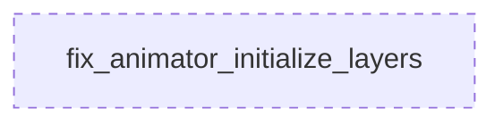

# Tasks: Domain Specialist

## 1. 🦅 Eagle View

This project is **Timelapse Engine**, a video rendering pipeline for PSD animations. Current feature: **Test Fix Sprint** to repair broken unit/integration tests.

System has **2 agents**:
- **DomainSpecialist**: Fixes core domain logic (`animator_module.py`)
- **TestSpecialist**: Fixes test infrastructure (`benchmark_gpu_vs_cpu.py`)

**Your focus:** DomainSpecialist. You run **IN PARALLEL** with TestSpecialist. DO NOT wait for them.

---

## 2. Role

**DomainSpecialist** - Maintains core business logic in the domain layer

**Responsibilities:**
- Fix `AnimationController.initialize_layers()` type handling
- Ensure backward compatibility with existing code

**Constraints:**
- MUST NOT modify adapter or infrastructure layers
- MUST NOT break existing passing tests
- **MUST NOT BLOCK other agents**

---

## 3. Interface Contracts

**Input (LayerEntity OR String):**
```json
{
  "layers": ["string_id"] | [{"id": "string", "position": {...}, ...}]
}
```

**Output (Unchanged):**
```json
{
  "layer_states": {"layer_id": LayerAnimState}
}
```

---

## 4. Task Map



---

## 5. Modular Tasks

### Task: `fix_animator_initialize_layers`

**Complexity:** 2/5 | **Dependencies:** NONE

**Description:**
Update `AnimationController.initialize_layers()` in `src/domain/modules/animator/animator_module.py` to handle both:
1. `List[LayerEntity]` - Full layer objects (current expectation)
2. `List[str]` - Layer IDs only (how tests call it)

**Implementation:**

```diff
def initialize_layers(self, layers: List[Any]):
    """
    Initialize animation state for layers.
    Args:
-        layers: List of LayerEntity objects.
+        layers: List of LayerEntity objects OR layer ID strings.
    """
    for layer in layers:
-        lid = layer.id
+        # Support both LayerEntity objects and raw string IDs
+        lid = layer if isinstance(layer, str) else layer.id
        if lid not in self.layer_states:
            # Initialize with layer's actual position
+            if isinstance(layer, str):
+                # String ID mode: initialize with default values
+                from ...value_objects.vector import Vector2
+                self.layer_states[lid] = LayerAnimState(
+                    position=Vector2(0, 0),
+                    opacity=1.0,
+                    visible=True
+                )
+            else:
+                # LayerEntity mode: use actual layer properties
                self.layer_states[lid] = LayerAnimState(
                    position=layer.position,
                    opacity=layer.opacity,
                    visible=layer.visible
                )
```

**Acceptance:**
- [ ] Method accepts `List[str]` without error
- [ ] Method accepts `List[LayerEntity]` without error  
- [ ] Existing state initialization logic preserved
- [ ] Tests fix: `brush_reveal_multi_object_test.py`
- [ ] Tests fix: `brush_reveal_easing_showcase_test.py`
- [ ] Tests fix: `render_frames_debug.py`

**Notes:**
- Tests manually set positions AFTER calling `initialize_layers()`, so default `Vector2(0,0)` is acceptable for string ID mode
- `LayerAnimState` import already exists in class constructor
