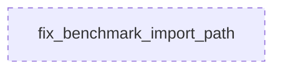

# Tasks: Test Specialist

## 1. 🦅 Eagle View

This project is **Timelapse Engine**, a video rendering pipeline for PSD animations. Current feature: **Test Fix Sprint** to repair broken unit/integration tests.

System has **2 agents**:
- **DomainSpecialist**: Fixes core domain logic (`animator_module.py`)
- **TestSpecialist**: Fixes test infrastructure (`benchmark_gpu_vs_cpu.py`)

**Your focus:** TestSpecialist. You run **IN PARALLEL** with DomainSpecialist. DO NOT wait for them.

---

## 2. Role

**TestSpecialist** - Maintains test infrastructure and fixtures

**Responsibilities:**
- Fix broken import paths in `benchmark_gpu_vs_cpu.py`
- Map deprecated `render_manager` API to new `pipeline_manager` API

**Constraints:**
- MUST NOT modify core domain modules
- MUST maintain test functionality/assertions
- **MUST NOT BLOCK other agents**

---

## 3. Interface Contracts

**Input (Current - BROKEN):**
```python
from src.domain.modules.render_manager.render_manager_module import (
    DirectorEngine,
    RenderConfig,
    EngineProgress,
)
```

**Output (Target - FIXED):**
```python
from src.domain.modules.pipeline_manager.director_engine import DirectorEngine
from src.domain.modules.pipeline_manager.config import RenderConfig
# EngineProgress likely in a different location
```

---

## 4. Task Map



---

## 5. Modular Tasks

### Task: `fix_benchmark_import_path`

**Complexity:** 3/5 | **Dependencies:** NONE

**Description:**
Update import paths in `tests/benchmark_gpu_vs_cpu.py` to use the new `pipeline_manager` module structure instead of deleted `render_manager`.

**Research Required:**
1. Check what classes exist in `src/domain/modules/pipeline_manager/`
2. Find where `DirectorEngine`, `RenderConfig`, `EngineProgress` are now defined
3. Verify the new API signatures match test expectations

**Known Files in `pipeline_manager/`:**
```
├── __init__.py
├── config.py               <- Likely contains RenderConfig
├── cpu_strategy.py
├── cursor_overlay.py
├── director_engine.py      <- Likely contains DirectorEngine
├── gpu_backend_module.py
├── gpu_strategy.py
├── optimized_strategy.py
├── parallel_renderer.py
├── pipeline_manager_module.py
├── render_pipeline.py
└── ui_helper.py
```

**Implementation Steps:**

1. **Inspect `director_engine.py`** for `DirectorEngine` class
2. **Inspect `config.py`** for `RenderConfig` dataclass
3. **Search for `EngineProgress`** - may be in `src/domain/core/` or similar
4. **Update imports** in `benchmark_gpu_vs_cpu.py`
5. **Verify API compatibility** - method names, constructor signatures

**Acceptance:**
- [ ] No `ModuleNotFoundError` on import
- [ ] `create_engine_for_cpu()` creates valid engine
- [ ] `create_engine_for_gpu()` creates valid engine
- [ ] `run_cpu_benchmark()` executes without errors
- [ ] `run_gpu_benchmark()` executes without errors
- [ ] Benchmark results saved to JSON

**Notes:**
- Test uses `DirectorEngine.load_project()`, `generate_timeline()`, `run_optimized()`, `run_gpu()` methods
- Verify all these methods exist in new class
- If API has changed significantly, may need test logic updates too
