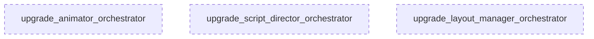

# Tasks: Module Architect A

## 1. 🦅 Eagle View

This project is **Timelapse Engine**, a video rendering pipeline for PSD animations. Current feature: **Module Orchestrator Upgrade** to convert simple `__init__.py` indexes into intelligent orchestrators with factory methods, validation, and clear APIs.

System has **2 agents**:
- **ModuleArchitect_A**: Handles `animator`, `script_director`, `layout_manager` (simpler modules)
- **ModuleArchitect_B**: Handles `compositor`, `pipeline_manager` (complex modules)

**Your focus:** ModuleArchitect_A. You run **IN PARALLEL** with ModuleArchitect_B. DO NOT wait for them.

---

## 2. Role

**ModuleArchitect_A** - Upgrade simpler domain modules to orchestrator pattern

**Responsibilities:**
- Upgrade `animator/__init__.py` to smart orchestrator
- Upgrade `script_director/__init__.py` to smart orchestrator
- Upgrade `layout_manager/__init__.py` to smart orchestrator

**Constraints:**
- Each `__init__.py` must stay < 150 lines
- No breaking changes to existing public API
- **MUST NOT BLOCK ModuleArchitect_B**

---

## 3. Interface Contracts

**Input (Current `__init__.py`):**
```python
# Simple re-exports
from .module import Class
__all__ = ['Class']
```

**Output (Orchestrator `__init__.py`):**
```python
# Smart orchestrator with factory
@dataclass
class ModuleConfig: ...

def create_module(**kwargs) -> MainClass: ...

class MainClass:
    def __init__(self, config=None): ...
    def validate(self): ...

__all__ = ['MainClass', 'ModuleConfig', 'create_module']
```

---

## 4. Task Map



---

## 5. Modular Tasks

### Task 1: `upgrade_animator_orchestrator`

**Complexity:** 3/5 | **Dependencies:** NONE

**Description:**
Upgrade `engine/src/domain/modules/animator/__init__.py` to orchestrator pattern.

**Current Structure (8 files):**
- `animator_module.py` - AnimationController (main)
- `anim_state_module.py` - LayerAnimState, CursorState
- `bezier_solver_module.py` - Easing functions
- `path_generator_module.py` - Motion paths
- `mask_generator_module.py` - Reveal masks
- `drag_strategy_module.py` - Drag animation
- `brush_strategy_module.py` - Brush animation

**Implementation:**

```python
"""
Animator Orchestrator
=====================
Coordinates motion, timing, and animation state management.
"""
from dataclasses import dataclass
from typing import Optional

@dataclass
class AnimatorConfig:
    viewport_width: int = 1080
    viewport_height: int = 1920
    default_easing: str = "ease_out"

def create_animator(
    width: int = 1080, 
    height: int = 1920
) -> "AnimationController":
    """Factory: Create animator with viewport dimensions."""
    from .animator_module import AnimationController
    return AnimationController(width, height)

# Re-exports (backward compatible)
from .animator_module import AnimationController
from .anim_state_module import LayerAnimState, CursorState
# ... other exports

__all__ = [
    'AnimatorConfig',
    'create_animator',
    'AnimationController',
    # ... minimal public API
]
```

**Acceptance:**
- [ ] Factory function `create_animator()` works
- [ ] Config dataclass defined
- [ ] Existing imports still work (backward compatible)
- [ ] No circular import errors

---

### Task 2: `upgrade_script_director_orchestrator`

**Complexity:** 2/5 | **Dependencies:** NONE

**Description:**
Upgrade `engine/src/domain/modules/script_director/__init__.py` to orchestrator pattern.

**Current Structure (4 files):**
- `timeline_planner_module.py` - Timeline, Action, plan_timeline
- `action_classifier_module.py` - ActionType classification
- `layer_classifier_module.py` - Layer classification

**Implementation:**

```python
"""
Script Director Orchestrator
============================
Pre-production planning: layer analysis and timeline generation.
"""
from dataclasses import dataclass
from typing import List, Optional

@dataclass
class ScriptDirectorConfig:
    default_strategy: str = "STAGGERED"
    action_duration: float = 2.0

def create_timeline(
    layers: List,
    strategy: str = "STAGGERED"
) -> "Timeline":
    """Factory: Generate timeline from layers."""
    from .timeline_planner_module import plan_timeline, SequencingStrategy
    strat = getattr(SequencingStrategy, strategy, SequencingStrategy.STAGGERED)
    return plan_timeline(layers, strat)

# Re-exports
from .timeline_planner_module import Timeline, Action, SequencingStrategy, plan_timeline
from .action_classifier_module import ActionType
# ...

__all__ = [
    'ScriptDirectorConfig',
    'create_timeline',
    'Timeline', 'Action', 'ActionType',
    'SequencingStrategy', 'plan_timeline',
]
```

**Acceptance:**
- [ ] Factory function `create_timeline()` works
- [ ] Config dataclass defined
- [ ] Existing imports still work

---

### Task 3: `upgrade_layout_manager_orchestrator`

**Complexity:** 1/5 | **Dependencies:** NONE

**Description:**
Upgrade `engine/src/domain/modules/layout_manager/__init__.py` to orchestrator pattern.

**Current Structure (1 file):**
- `coordinate_mapper_module.py` - CoordinateMapper

**Implementation:**

```python
"""
Layout Manager Orchestrator
===========================
Scene blocking and coordinate transformations.
"""
from dataclasses import dataclass
from typing import Optional

@dataclass
class LayoutConfig:
    world_width: int = 1080
    world_height: int = 1080
    viewport_width: int = 1080
    viewport_height: int = 1920

def create_coordinate_mapper(
    world_size: tuple = (1080, 1080),
    viewport_size: tuple = (1080, 1920)
) -> "CoordinateMapper":
    """Factory: Create mapper with dimensions."""
    from .coordinate_mapper_module import CoordinateMapper
    return CoordinateMapper(
        world_width=world_size[0],
        world_height=world_size[1],
        viewport_width=viewport_size[0],
        viewport_height=viewport_size[1]
    )

# Re-exports
from .coordinate_mapper_module import CoordinateMapper

__all__ = [
    'LayoutConfig',
    'create_coordinate_mapper',
    'CoordinateMapper',
]
```

**Acceptance:**
- [ ] Factory function `create_coordinate_mapper()` works
- [ ] Config dataclass defined
- [ ] Existing imports still work

---

## State Machine

| State | Trigger | Next | Action |
|-------|---------|------|--------|
| IDLE | Start task | IMPLEMENTING | Begin code changes |
| IMPLEMENTING | File saved | TESTING | Run import test |
| TESTING | Pass | DONE | Mark complete |
| TESTING | Fail | IMPLEMENTING | Fix errors |
| IMPLEMENTING | Circular import | BLOCKED | Refactor lazy import |
| BLOCKED | Fixed | IMPLEMENTING | Resume |
