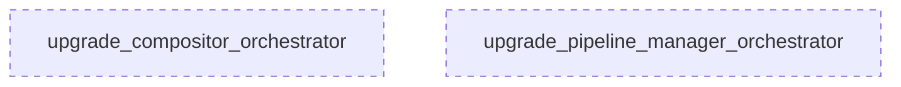

# Tasks: Module Architect B

## 1. 🦅 Eagle View

This project is **Timelapse Engine**, a video rendering pipeline for PSD animations. Current feature: **Module Orchestrator Upgrade** to convert simple `__init__.py` indexes into intelligent orchestrators with factory methods, validation, and clear APIs.

System has **2 agents**:
- **ModuleArchitect_A**: Handles `animator`, `script_director`, `layout_manager` (simpler modules)
- **ModuleArchitect_B**: Handles `compositor`, `pipeline_manager` (complex modules)

**Your focus:** ModuleArchitect_B. You run **IN PARALLEL** with ModuleArchitect_A. DO NOT wait for them.

---

## 2. Role

**ModuleArchitect_B** - Upgrade complex domain modules to orchestrator pattern

**Responsibilities:**
- Upgrade `compositor/__init__.py` to smart orchestrator
- Upgrade `pipeline_manager/__init__.py` to smart orchestrator

**Constraints:**
- Each `__init__.py` must stay < 150 lines
- No breaking changes to existing public API
- Handle complex internal dependencies carefully
- **MUST NOT BLOCK ModuleArchitect_A**

---

## 3. Interface Contracts

**Input (Current `__init__.py`):**
```python
# Simple re-exports with many classes
from .module import Class1, Class2, Class3
from .ops import op1, op2
__all__ = ['Class1', 'Class2', ...]
```

**Output (Orchestrator `__init__.py`):**
```python
# Smart orchestrator with factory + validation
@dataclass
class ModuleConfig: ...

def create_module(**kwargs) -> MainClass: ...

class ModuleOrchestrator:
    def __init__(self, config=None): ...
    def validate(self) -> bool: ...
    def get_component(self, name: str): ...

__all__ = ['ModuleOrchestrator', 'ModuleConfig', 'create_module', ...]
```

---

## 4. Task Map



---

## 5. Modular Tasks

### Task 1: `upgrade_compositor_orchestrator`

**Complexity:** 4/5 | **Dependencies:** NONE

**Description:**
Upgrade `engine/src/domain/modules/compositor/__init__.py` to orchestrator pattern.

**Current Structure (11 files):**
- `compositor_module.py` - FrameCompositor (main)
- `layer_compositor_module.py` - MultiLayerCompositor
- `layer_cache_module.py` - LayerCache
- `viewport_compositor_module.py` - ViewportCompositor
- `layer_service.py` - LayerRetrievalService
- **Ops:** `blur_op.py`, `opacity_op.py`, `composite_op.py`, `reveal_op.py`, `subpixel_op.py`

**Implementation:**

```python
"""
Compositor Orchestrator
=======================
Layer merging, effects, and frame composition.

Public API:
- CompositorOrchestrator: High-level compositor with all components
- create_compositor(): Factory with sensible defaults
- FrameCompositor: Direct access (backward compatible)
"""
from dataclasses import dataclass
from typing import Optional, TYPE_CHECKING

if TYPE_CHECKING:
    from ...entities.world_entity import WorldEntity
    from ...entities.viewport_entity import ViewportEntity

@dataclass
class CompositorConfig:
    enable_motion_blur: bool = True
    enable_subpixel: bool = True
    cache_static_layers: bool = True

class CompositorOrchestrator:
    """
    High-level compositor that coordinates all composition components.
    
    Usage:
        orchestrator = create_compositor(world, viewport)
        frame = orchestrator.compose_frame(layer_states)
    """
    
    def __init__(
        self, 
        world: "WorldEntity",
        viewport: "ViewportEntity",
        config: Optional[CompositorConfig] = None
    ):
        self.config = config or CompositorConfig()
        self._world = world
        self._viewport = viewport
        self._compositor = None  # Lazy init
        self._cache = None
    
    @property
    def compositor(self) -> "FrameCompositor":
        if self._compositor is None:
            from .compositor_module import FrameCompositor
            self._compositor = FrameCompositor(self._world, self._viewport)
        return self._compositor
    
    @property
    def cache(self) -> "LayerCache":
        if self._cache is None:
            from .layer_cache_module import LayerCache
            self._cache = LayerCache()
        return self._cache
    
    def compose_frame(self, layer_states, find_layer_fn):
        """Compose single frame with current settings."""
        return self.compositor.compose_psd_content(layer_states, find_layer_fn)
    
    def validate(self) -> bool:
        """Validate all components are properly initialized."""
        return self._world is not None and self._viewport is not None

def create_compositor(
    world: "WorldEntity",
    viewport: "ViewportEntity",
    **config_kwargs
) -> CompositorOrchestrator:
    """Factory: Create compositor orchestrator."""
    config = CompositorConfig(**config_kwargs)
    return CompositorOrchestrator(world, viewport, config)

# Backward compatible re-exports
from .compositor_module import FrameCompositor, CursorStyle
from .layer_cache_module import LayerCache
# ... other exports

__all__ = [
    # New Orchestrator API
    'CompositorOrchestrator',
    'CompositorConfig', 
    'create_compositor',
    # Backward compatible
    'FrameCompositor',
    'LayerCache',
    # ...
]
```

**Acceptance:**
- [ ] `CompositorOrchestrator` class works
- [ ] Factory function `create_compositor()` works
- [ ] Lazy loading prevents circular imports
- [ ] Validate method works
- [ ] Existing imports still work

---

### Task 2: `upgrade_pipeline_manager_orchestrator`

**Complexity:** 5/5 | **Dependencies:** NONE

**Description:**
Upgrade `engine/src/domain/modules/pipeline_manager/__init__.py` to orchestrator pattern.

**Current Structure (12 files):**
- `director_engine.py` - DirectorEngine (main coordinator)
- `pipeline_manager_module.py` - PipelineManager
- `render_pipeline.py` - RenderPipeline
- `config.py` - EngineState, RenderConfig, EngineProgress
- **Strategies:** `cpu_strategy.py`, `optimized_strategy.py`, `gpu_strategy.py`
- **Helpers:** `cursor_overlay.py`, `ui_helper.py`, `parallel_renderer.py`, `gpu_backend_module.py`

**Implementation:**

```python
"""
Pipeline Manager Orchestrator
=============================
Central rendering pipeline coordination.

Public API:
- PipelineOrchestrator: High-level pipeline with strategy selection
- create_pipeline(): Factory with auto-configuration
- DirectorEngine: Direct access (backward compatible)
"""
from dataclasses import dataclass
from typing import Optional, Callable, Any, Literal
from enum import Enum

class RenderMode(Enum):
    CPU = "cpu"
    OPTIMIZED = "optimized"
    GPU = "gpu"

@dataclass
class PipelineConfig:
    mode: RenderMode = RenderMode.OPTIMIZED
    fps: int = 30
    width: int = 1080
    height: int = 1920
    enable_cursor: bool = True

class PipelineOrchestrator:
    """
    High-level pipeline that auto-selects best render strategy.
    
    Usage:
        pipeline = create_pipeline(mode="gpu")
        pipeline.load_project("design.psd")
        pipeline.render("output.mp4")
    """
    
    def __init__(self, config: Optional[PipelineConfig] = None, **port_kwargs):
        self.config = config or PipelineConfig()
        self._engine = None
        self._port_kwargs = port_kwargs
    
    @property
    def engine(self) -> "DirectorEngine":
        if self._engine is None:
            from .director_engine import DirectorEngine
            self._engine = DirectorEngine(**self._port_kwargs)
        return self._engine
    
    def load_project(self, psd_path: str):
        return self.engine.load_project(psd_path)
    
    def generate_timeline(self, strategy: str = "STAGGERED"):
        from .config import SequencingStrategy
        strat = getattr(SequencingStrategy, strategy, SequencingStrategy.STAGGERED)
        return self.engine.generate_timeline(strat)
    
    def render(self, output_path: str) -> str:
        from .config import RenderConfig
        config = RenderConfig(
            output_path=output_path,
            fps=self.config.fps,
            width=self.config.width,
            height=self.config.height
        )
        if self.config.mode == RenderMode.GPU:
            return self.engine.run_gpu(config)
        elif self.config.mode == RenderMode.OPTIMIZED:
            return self.engine.run_optimized(config)
        else:
            return self.engine.run(config)
    
    def validate(self) -> bool:
        return True  # Check ports injected

def create_pipeline(
    mode: str = "optimized",
    **kwargs
) -> PipelineOrchestrator:
    """Factory: Create pipeline with specified mode."""
    render_mode = RenderMode(mode.lower())
    config = PipelineConfig(mode=render_mode, **{k: v for k, v in kwargs.items() if k in PipelineConfig.__dataclass_fields__})
    port_kwargs = {k: v for k, v in kwargs.items() if k not in PipelineConfig.__dataclass_fields__}
    return PipelineOrchestrator(config, **port_kwargs)

# Backward compatible re-exports
from .config import EngineState, EngineProgress, RenderConfig
from .director_engine import DirectorEngine
from .pipeline_manager_module import PipelineManager
# ... other exports

__all__ = [
    # New Orchestrator API
    'PipelineOrchestrator',
    'PipelineConfig',
    'RenderMode',
    'create_pipeline',
    # Backward compatible
    'DirectorEngine',
    'EngineState',
    'RenderConfig',
    # ...
]
```

**Acceptance:**
- [ ] `PipelineOrchestrator` class works
- [ ] Factory function `create_pipeline()` works
- [ ] Mode selection (cpu/optimized/gpu) works
- [ ] Lazy loading prevents circular imports
- [ ] Existing imports still work

---

## State Machine

| State | Trigger | Next | Action |
|-------|---------|------|--------|
| IDLE | Start task | IMPLEMENTING | Begin code changes |
| IMPLEMENTING | File saved | TESTING | Run import test |
| TESTING | Pass | DONE | Mark complete |
| TESTING | Fail | IMPLEMENTING | Fix errors |
| IMPLEMENTING | Circular import | BLOCKED | Refactor lazy import |
| BLOCKED | Fixed | IMPLEMENTING | Resume |
| IMPLEMENTING | Port injection issue | DEBUGGING | Check DI pattern |
| DEBUGGING | Fixed | TESTING | Re-test |
