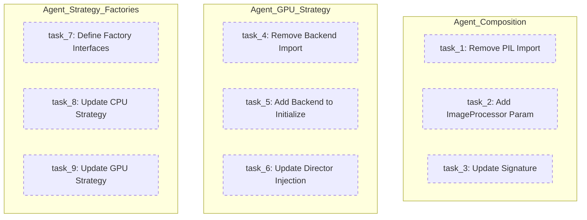

# Pipeline Manager Compliance Refactoring Plan

## Computational Analysis

| Metric | Value |
|--------|-------|
| **Total Tasks** | 9 |
| **Agents** | 3 (100% Parallel) |
| **Dependencies** | 0 |
| **Total Effort** | 26 |
| **Parallel Time** | 4 (Max Single Task) |
| **Speedup Factor** | 6.5x |

---

## Task Map (All Parallel - No Arrows)



---

## Agent Allocation

| Agent | Focus Area | Priority | Files |
|-------|------------|----------|-------|
| `agent_composition` | PIL Import Removal | P1 - Critical | `layer_composition_module.py` |
| `agent_gpu_strategy` | Backend Injection | P2 - High | `gpu_strategy_module.py`, `director_engine_module.py` |
| `agent_strategy_factories` | Factory Pattern | P3 - Medium | `cpu_strategy_module.py`, `gpu_strategy_module.py` |

---

## Verification Plan

### Existing Tests (Use These)

| Test File | Coverage |
|-----------|----------|
| `scenario/integration/test_02_layer_render.py` | Layer rendering pipeline |
| `scenario/integration/test_03_compositing.py` | Composition logic |
| `scenario/integration/test_04_final_pipeline.py` | Full pipeline flow |
| `scenario/integration/test_05_director_integration.py` | DirectorEngine |

### Run Command

```bash
cd engine/src/domain/modules/pipeline_manager/scenario
python -m pytest integration/ -v
```

### Manual Verification

1. Run existing tests - should pass without changes to behavior
2. Import check: `grep -r "from PIL" rendering/` should return empty after refactor

---

## Agent Task Files

- [tasks_agent_composition.md](file:///home/rakaarwaky/Work/App%20Project/Psd%20Timelapse/.agent/doc/plan_pipeline_compliance/tasks_agent_composition.md)
- [tasks_agent_gpu_strategy.md](file:///home/rakaarwaky/Work/App%20Project/Psd%20Timelapse/.agent/doc/plan_pipeline_compliance/tasks_agent_gpu_strategy.md)
- [tasks_agent_strategy_factories.md](file:///home/rakaarwaky/Work/App%20Project/Psd%20Timelapse/.agent/doc/plan_pipeline_compliance/tasks_agent_strategy_factories.md)
