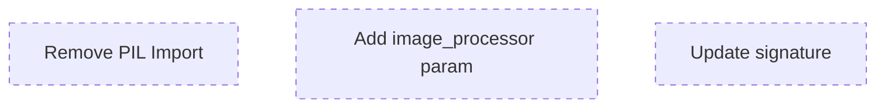

# Agent: Composition Refactoring

## 1. 🦅 Eagle View

This project is **Psd Timelapse Engine**, a domain-driven rendering pipeline. Current feature: **Compliance Refactoring** to enforce "Blind Logic" pattern. System has 3 agents:
- **Agent Composition**: Remove PIL imports from `layer_composition_module.py`
- **Agent GPU Strategy**: Inject GpuBackend instead of internal import
- **Agent Strategy Factories**: Add factory injection for AnimationController/FrameCompositor

**Your focus:** Agent Composition. You run **IN PARALLEL** with others. DO NOT wait for them.

---

## 2. Role

**Composition Refactor Agent** - Remove infrastructure imports from rendering submodule.

**Responsibilities:**
- Remove direct `from PIL import Image, ImageDraw`
- Add `image_processor: Any` parameter to functions
- Update function signatures to be "Blind"

**Constraints:**
- Must not break existing function behavior
- Must not wait for other agents
- All changes in `rendering/layer_composition_module.py`

---

## 3. Interface Contracts

**Input (From Orchestrator):**
```json
{
  "image_processor": "Any (PIL.Image compatible)",
  "layer_img": "Any"
}
```

**Output (Unchanged):**
```json
{
  "canvas": "Image (returned as Any)"
}
```

---

## 4. Task Map



---

## 5. Tasks (Simultaneous)

### Task 1: Remove PIL Import
**Complexity:** 2 | **Dependencies:** NONE

**Description:** 
Remove lines 3-6 in `layer_composition_module.py`:
```python
# DELETE THESE:
from PIL import Image, ImageDraw
```

**Acceptance:**
- [ ] No `from PIL` in file
- [ ] File still parses (no syntax errors)

---

### Task 2: Add image_processor Parameter
**Complexity:** 3 | **Dependencies:** NONE

**Description:**
Add `image_processor: Any` to `render_layer_to_image()` signature.

```diff
def render_layer_to_image(
    layer_img: Image.Image,
+   image_processor: Any,
    layer: LayerEntity, 
    ...
```

**Acceptance:**
- [ ] New parameter added
- [ ] Type hint is `Any` (not PIL.Image)

---

### Task 3: Update Internal Calls
**Complexity:** 3 | **Dependencies:** NONE

**Description:**
Replace all `Image.new()` and `ImageDraw.Draw()` with `image_processor` methods.

```diff
-canvas = Image.new('RGBA', (canvas_width, canvas_height), (0, 0, 0, 0))
+canvas = image_processor.new('RGBA', (canvas_width, canvas_height), (0, 0, 0, 0))

-draw = ImageDraw.Draw(mask)
+draw = image_processor.draw(mask)
```

**Acceptance:**
- [ ] All `Image.` replaced with `image_processor.`
- [ ] All `ImageDraw.` replaced with `image_processor.draw` or similar

---

## 6. Verification

```bash
# Run integration tests
cd engine/src/domain/modules/pipeline_manager/scenario
python -m pytest integration/test_02_layer_render.py -v
python -m pytest integration/test_03_compositing.py -v
```
