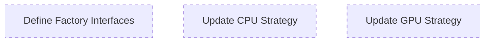

# Agent: Strategy Factories Refactoring

## 1. 🦅 Eagle View

This project is **Psd Timelapse Engine**, a domain-driven rendering pipeline. Current feature: **Compliance Refactoring** to enforce "Blind Logic" pattern. System has 3 agents:
- **Agent Composition**: Remove PIL imports from `layer_composition_module.py`
- **Agent GPU Strategy**: Inject GpuBackend instead of internal import
- **Agent Strategy Factories**: Add factory injection for AnimationController/FrameCompositor

**Your focus:** Agent Strategy Factories. You run **IN PARALLEL** with others. DO NOT wait for them.

---

## 2. Role

**Strategy Factories Agent** - Add optional factory injection for domain services.

**Responsibilities:**
- Define factory type hints in strategy modules
- Add optional `anim_controller_factory` and `compositor_factory` params
- Update execute() to use factories if provided

**Constraints:**
- This is P3 (Medium priority) - **preserve backward compatibility**
- Must not break existing behavior when factories are not provided
- Changes in `cpu_strategy_module.py` and `gpu_strategy_module.py`

---

## 3. Interface Contracts

**Input (Optional Factories):**
```json
{
  "anim_controller_factory": "Optional[Callable[[], AnimationController]]",
  "compositor_factory": "Optional[Callable[[], FrameCompositor]]"
}
```

**Output (Unchanged):**
```json
{
  "output_path": "str"
}
```

---

## 4. Task Map



---

## 5. Tasks (Simultaneous)

### Task 7: Define Factory Type Aliases
**Complexity:** 3 | **Dependencies:** NONE

**Description:** 
Add type aliases at top of both strategy modules:

```python
from typing import Callable, Optional, Any

# Factory type aliases (blind - no imports)
AnimControllerFactory = Callable[[int, int], Any]  # (width, height) -> controller
CompositorFactory = Callable[[Any, Any], Any]  # (world, viewport) -> compositor
```

**Acceptance:**
- [ ] Type aliases defined in both files
- [ ] No direct imports of AnimationController/FrameCompositor types

---

### Task 8: Update CPU Strategy execute()
**Complexity:** 3 | **Dependencies:** NONE

**Description:**
Add optional factory params with backward compatibility:

```diff
def execute(self, 
            config: RenderConfig, 
            timeline: TimelineEntity, 
            video_port: VideoPort,
            ui_renderer: Any,
            find_layer_fn: Callable[[str], Optional[LayerEntity]],
            progress_callback: Callable[[EngineState, int, int, str], None],
            camera: CameraEntity,
-           media_output: Optional['MediaOutputPath'] = None
+           media_output: Optional['MediaOutputPath'] = None,
+           anim_controller_factory: Optional[AnimControllerFactory] = None,
+           compositor_factory: Optional[CompositorFactory] = None
            ) -> str:
    
    # Use factory if provided, else fallback to import
-   anim_controller = AnimationController(config.width, config.height)
+   if anim_controller_factory:
+       anim_controller = anim_controller_factory(config.width, config.height)
+   else:
+       from ...animator import AnimationController
+       anim_controller = AnimationController(config.width, config.height)
```

**Acceptance:**
- [ ] Optional factory params added
- [ ] Fallback to direct import if factory not provided
- [ ] Backward compatible (existing calls still work)

---

### Task 9: Update GPU Strategy execute()
**Complexity:** 3 | **Dependencies:** NONE

**Description:**
Same pattern as Task 8, applied to `gpu_strategy_module.py`:

```diff
def execute(self, 
            config: RenderConfig, 
            ...
+           anim_controller_factory: Optional[AnimControllerFactory] = None,
+           compositor_factory: Optional[CompositorFactory] = None
            ) -> str:
    
+   if anim_controller_factory:
+       anim_controller = anim_controller_factory(config.width, config.height)
+   else:
+       from ...animator import AnimationController
+       anim_controller = AnimationController(config.width, config.height)
```

**Acceptance:**
- [ ] Factory params added to GPU strategy
- [ ] Same fallback pattern as CPU

---

## 6. Verification

```bash
# Run ALL integration tests (ensure backward compatibility)
cd engine/src/domain/modules/pipeline_manager/scenario
python -m pytest integration/ -v

# Specific test for pipeline
python -m pytest integration/test_04_final_pipeline.py -v
```

---

## 7. Notes

> [!IMPORTANT]
> This is **P3 - Medium priority**. The existing direct imports are **borderline compliant** because `AnimationController` and `FrameCompositor` are Domain Services, not Infrastructure.
> 
> This refactoring is for **maximum purity** but is optional. If time is limited, skip this agent.
