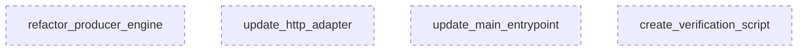

# Plan: SSOT Refactor Overview

## Computational Analysis
**Tasks:** 4 | **Execution Mode:** PARALLEL | **Framework:** Hexagonal (Independent Layers)

## Task Indepedence Graph

## Agent Allocation
| Agent | Role | Assigned Tasks |
|-------|------|----------------|
| **DomainArchitect** | Core Logic | `refactor_producer_engine` |
| **AdapterSpecialist** | Adapters | `update_http_adapter` |
| **IntegrationLead** | Wiring | `update_main_entrypoint`, `create_verification_script` |

