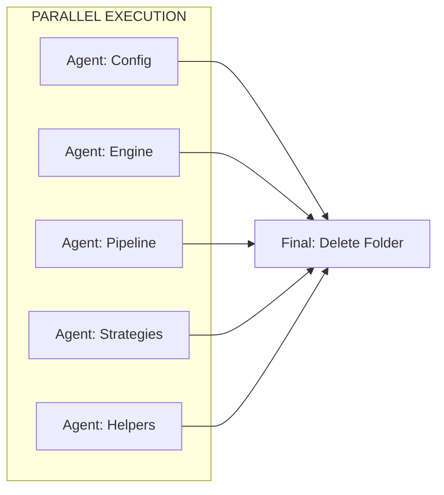

# Plan: Remove `render_manager` → Migrate to `pipeline_manager`

## True Parallel Structure (No Dependencies)

Setiap agent menghandle **satu komponen end-to-end** (migrate + update imports), tanpa menunggu agent lain.



## Agent Assignments

| Agent | Component | Migrate | Update Imports |
|-------|-----------|---------|----------------|
| **Config** | config.py | ✅ | All `EngineState`, `RenderConfig`, `EngineProgress` |
| **Engine** | director_engine.py | ✅ | All `DirectorEngine` |
| **Pipeline** | render_pipeline.py | ✅ | All `RenderPipeline`, `PipelineState`, `PipelineConfig` |
| **Strategies** | strategies/*.py | ✅ | All `*RenderStrategy` |
| **Helpers** | cursor, ui_helper, parallel | ✅ | All helper functions |

## Parallelism Guarantee

✅ **NO inter-agent dependencies**
- Each agent works on DIFFERENT files
- Each agent updates DIFFERENT import statements
- Agents can run in ANY ORDER or SIMULTANEOUSLY

## Import Ownership

| Agent | Owns these imports in target files |
|-------|-----------------------------------|
| Config | `from .config import EngineState, EngineProgress, RenderConfig` |
| Engine | `from .director_engine import DirectorEngine` |
| Pipeline | `from .render_pipeline import RenderPipeline, PipelineState, ...` |
| Strategies | `from .strategies import CPURenderStrategy, ...` |
| Helpers | `from .cursor_overlay import ...`, `from .ui_helper import ...` |

## Final Step (After All Agents)

```bash
rm -rf engine/src/domain/modules/render_manager
```

## Agent Task Files

- [tasks_config.md](file:///home/rakaarwaky/Work/App%20Project/client-app/.agent/doc/plan_render_manager_removal/tasks_config.md)
- [tasks_engine.md](file:///home/rakaarwaky/Work/App%20Project/client-app/.agent/doc/plan_render_manager_removal/tasks_engine.md)
- [tasks_pipeline.md](file:///home/rakaarwaky/Work/App%20Project/client-app/.agent/doc/plan_render_manager_removal/tasks_pipeline.md)
- [tasks_strategies.md](file:///home/rakaarwaky/Work/App%20Project/client-app/.agent/doc/plan_render_manager_removal/tasks_strategies.md)
- [tasks_helpers.md](file:///home/rakaarwaky/Work/App%20Project/client-app/.agent/doc/plan_render_manager_removal/tasks_helpers.md)
