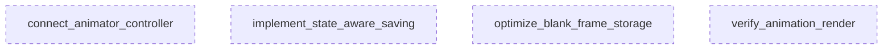

# Plan: Smart Director Render Fix (Parallel Execution)

## 🦅 Eagle View
**Goal**: operationalize the Smart Script Director by connecting the `LayerRenderer` to the `AnimationController`, ensuring layers move, appear, and persist correctly without converting to video formats yet (EXR sequences only).

## 📊 Computational Analysis
* **Execution Mode**: **PURE PARALLEL** (0 Dependencies)
* **Total Tasks**: 4
* **Agent Focus**: `RendererDev`

## 🕸️ Task Independence Graph

