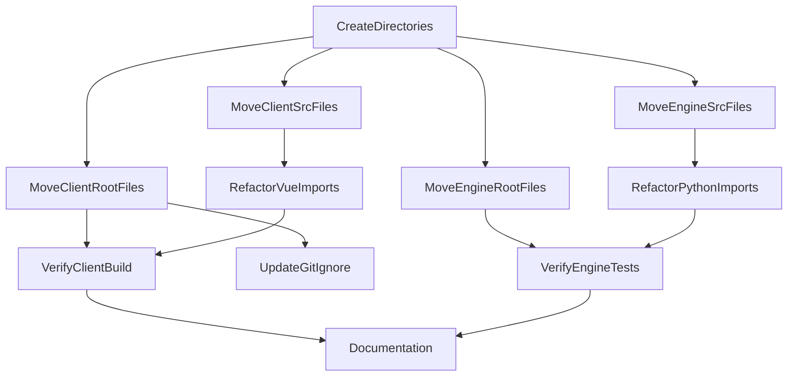

# Refactoring Plan: Split Info Client & Engine

## 1. 🦅 Eagle View

This project splits the monolith into:
- **Client**: Vue.js + JavaScript (Frontend)
- **Engine**: Python (Backend/Core)

## 2. Task Dependency Graph (DAG)

## 3. Tasks Execution Order

1. **CreateDirectories**
2. **MoveClientRootFiles**
3. **MoveClientSrcFiles**
4. **MoveEngineRootFiles**
5. **MoveEngineSrcFiles**
6. **UpdateGitIgnore**
7. **RefactorVueImports**
8. **RefactorPythonImports**
9. **VerifyClientBuild**
10. **VerifyEngineTests**
11. **Documentation**
