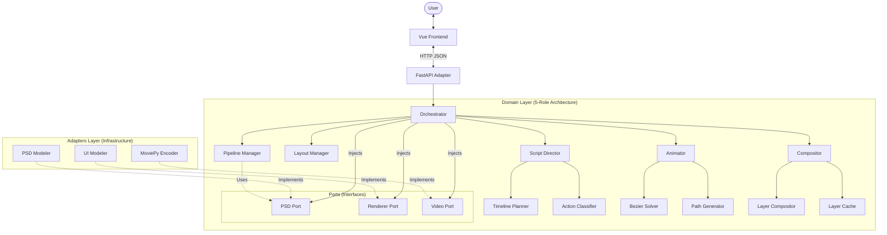
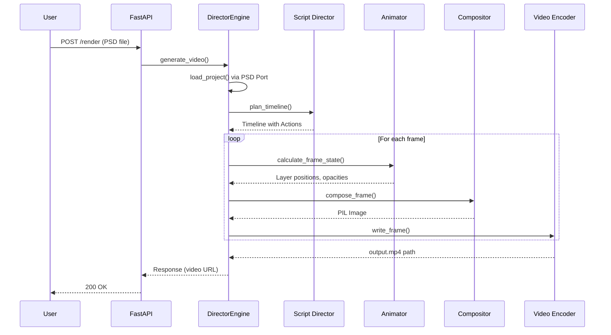

# Architecture Reference

**Architecture Pattern**: Hexagonal Architecture (Ports & Adapters)  
**Core Model**: 5-Role Orchestrated Pipeline  
**Coordinate System**: World-Camera-Viewport (Blender-like)

---

## 1. System Map



---

```text
psd-timelapse/
│
├── engine/
│   ├── main.py                             # 🏗️ Entry Point (FastAPI + Engine Bootstrap)
│   ├── requirements.txt                    # 📦 Python Dependencies
│   ├── media/                              # 📂 Output Directory
│   │   └── test_project/                   # Standardized Test Artifacts
│   │
│   └── src/
│       ├── adapters/                       # 🔌 ADAPTERS (Infrastructure)
│       │   ├── driven/                     # (Outbound) Trade Partners
│       │   │   ├── psd_modeler/            # PSD Parsing Implementation
│       │   │   ├── ui_modeler/             # UI Overlay Rendering
│       │   │   ├── video_encoder/          # Video Encoding
│       │   │   └── notification/           # Console/Logs
│       │   │
│       │   └── driving/                    # (Inbound) Entry Points
│       │       └── http_api_adapter.py     # FastAPI Routes
│       │
│       ├── domain/                         # 🏰 DOMAIN LAYER (Business Logic)
│       │   ├── core/                       # 🤴 ORCHESTRATOR
│       │   │   ├── engine.py               # Central Coordinator
│       │   │   └── protocol.py
│       │   │
│       │   ├── entities/                   # 📜 ENTITIES (Domain Objects)
│       │   │   ├── world_entity.py
│       │   │   ├── timeline_entity.py
│       │   │   └── ...
│       │   │
│       │   ├── modules/                    # 📚 5-ROLE MODULES
│       │   │   ├── script_director/        # 🎬 Pre-production & Planning
│       │   │   ├── layout_manager/         # 📐 Coordinate Mapping
│       │   │   ├── animator/               # 🎭 Motion & Timing
│       │   │   ├── compositor/             # 🎨 Frame Composition
│       │   │   └── pipeline_manager/       # 🎥 Pipeline Orchestration
│       │   │       └── scenario/           # 🧪 Integration Tests
│       │   │
│       │   ├── ports/                      # 🛡️ PORTS (Interfaces)
│       │   │   ├── psd_port.py
│       │   │   └── ...
│       │   │
│       │   └── value_objects/              # 👥 VALUE OBJECTS
│       │
│       └── assets/                         # 📦 ASSETS
│           ├── Psd/                        # Test PSD Files
│           └── ...
│
├── web/                                    # 🟢 FRONTEND (Vue.js) (Renamed from client)
│   ├── src/
│   └── index.html
│
└── doc/                                    # Documentation
```

---

## 3. The 5-Role Architecture

Each module has a single responsibility, following the Hexagonal Architecture pattern:

### Role 1: Script Director 🎬
**Responsibility**: Pre-production planning - what happens and when.
- `analysis/`: Action and Layer classification
- `planners/`: Timeline planning logic
- `script_orchestrator.py`: Main Orchestrator

### Role 2: Layout Manager 📐
**Responsibility**: Scene blocking and coordinate transformation.
- `coordinate_mapper_module.py`: World ↔ Camera ↔ Viewport transformations
- `layout_orchestrator.py`: Orchestrator

### Role 3: Animator 🎭
**Responsibility**: Motion calculation and timing.
- `core/animator_controller_module.py`: Controls layer animation states
- `motion/bezier_solver_module.py`: Cubic Bézier math for smooth curves
- `motion/path_generator_module.py`: Generates drag and brush paths
- `animator_orchestrator.py`: Orchestrator

### Role 4: Compositor 🎨
**Responsibility**: Layer merging and frame composition.
- `orchestrators/compositor_module.py`: Main frame composition orchestrator
- `orchestrators/layer_compositor_module.py`: Layer blending and opacity
- `services/layer_service.py`: Layer retrieval and caching

### Role 5: Pipeline Manager 🎥
**Responsibility**: Pipeline orchestration and resource management.
- `orchestrator/director_engine_module.py`: DirectorEngine - main render loop
- `orchestrator/layer_render_pipeline_module.py`: Rendering Loop
- `scenario/`: Integration and Visual Tests

---

## 4. Data Flow



---

## 5. Component Responsibilities

### Core Entities (The Blender Model)

| Entity | Responsibility | Key Properties |
|--------|----------------|----------------|
| `WorldEntity` | Source of truth for the design | `width`, `height`, `scene` (layer graph) |
| `CameraEntity` | Defines visible area | `position`, `zoom`, `target` |
| `ViewportEntity` | Output frame spec | `output_width`, `output_height` |
| `LayerEntity` | Individual layer data | `name`, `position`, `opacity`, `image`, `action_hint` |
| `SceneEntity` | Layer hierarchy | `layers`, `iterate_visible()` |

### Adapters (External Integrations)

| Adapter | Implements | External Library |
|---------|------------|------------------|
| `PsdModeler` | `PsdPort` | `psd-tools` |
| `PillowRenderer` | `RendererPort` | `Pillow` |
| `UIRendererCore` | (Internal) | `Pillow` |
| `MoviePyEncoderAdapter` | `VideoPort` | `moviepy` |

