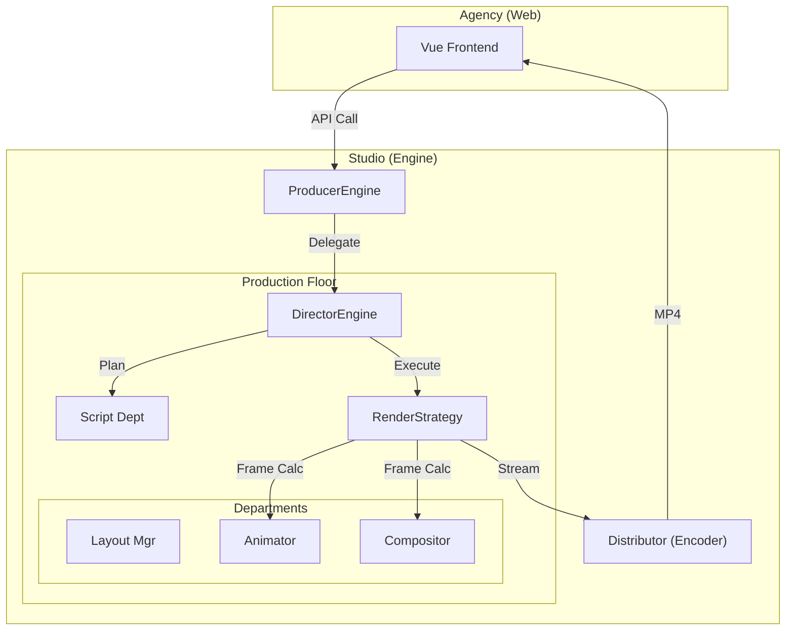

# The Creative Partnership: Workflow & Pipeline

This document outlines the workflow using the **Agency vs. Studio** metaphor to explain the relationship between the Client App and the Animation Engine.

---

## 🏗️ The Agency (@[web])

**Role:** The Account Manager & Client Liaison.
The **Client App (frontend)** acts as the **Creative Agency**. It doesn't make the movie; it manages the client (the user) and the project requirements.

### Responsibilities:
1.  **The Briefing (Input)**:
    *   Accepts the **Raw Material** (PSD File).
    *   Defines the **Project Requirements** (Resolution, Duration, FPS).
    *   Submits the **Work Order** to the Studio via API.
2.  **Project Tracking (Progress)**:
    *   Communicates with the Studio's producers to check status.
    *   Updates the client on percentage complete (Progress Bar).
3.  **Final Delivery (Output)**:
    *   Presenting the final "Premier" (Video Preview) to the user.
    *   Handling downloads and distribution.

---

## 🎬 The Animation Studio (@[engine])

**Role:** The Production House.
The **Engine (backend)** is the **Animation Studio**. It operates with a strict hierarchy of Roles and Departments, governed by the **Hexagonal Architecture**.

### 👤 The Executive Producer (`ProducerEngine`)
**"The Face of the Studio"**
*   **Location**: `src/domain/core/engine.py`
*   **Job**: The high-level entry point. Handles the "Contract" (API calls) and delegates work to the internal teams.
*   **Action**:
    *   `load_project()`: Accepts the PSD.
    *   `generate_video()`: Signs off on the full production run.
    *   **Executes**: `self.run(config)` -> Delegates to the Director.

### 🎥 The Production Pipeline (The 5 Departments)

Once the **Executive Producer** gives the green light, the **Director** takes over.

#### 1. The Director (Pipeline Manager) 🎬
**"The Boss on Set"**
*   **Code**: `DirectorEngine` (`pipeline_manager/orchestrator/`)
*   **Job**: Orchestrates the daily operations. Manages state (`EngineState`) and coordinates all other departments.
*   **Key Method**: `run_optimized()` or `run_gpu()` - Chooses the production strategy.

#### 2. The Scriptwriter (Script Director) ✍️
**"The Narrative Soul"**
*   **Code**: `script_orchestrator.py`
*   **Job**: Pre-production. Decides *what* happens and *when*.
*   **Action**: analyze layers -> `plan_production()`.
    *   **Classify**: "Is this a Background? A Prop? A Character?" (`classify_layer`)
    *   **Sequence**: "Stagger these entrances by 0.5s." (`SequencingStrategy`)

#### 3. The Cinematographer (Layout Manager) 📐
**"The Eye"**
*   **Code**: `CoordinateMapper` (`layout_manager/`)
*   **Job**: Translation.
*   **Action**: Maps the "World" (Infinite PSD Canvas) to the "Viewport" (1080p Output). Ensures the framing is correct before cameras roll.

#### 4. The Production Crew (Strategies) ⚙️
**"The Worker Bees"**
*   **Code**: `CPURenderStrategy`, `OptimizedRenderStrategy`
*   **Job**: The actual frame-by-frame execution loop.
*   **Process**:
    1.  **Animate**: Consult `AnimationController` for layer positions at Time `T`.
    2.  **Composite**: Send data to `FrameCompositor` to stack layers.
    3.  **Render**: Draw the pixels to a buffer.

#### 5. The VFX Team (Compositor) 🎨
**"The Magic"**
*   **Code**: `FrameCompositor` (`compositor/`)
*   **Job**: Blending and Effects.
*   **Action**: Takes raw layers and applies Opacity, Blend Modes, and Masking.

#### External Partners (Adapters & Ports) 📦
**"The Source & Distributor"**
*   **Asset Loader**: `PsdPort` -> `PsdModeler` (Logistics)
*   **Final Delivery**: `VideoPort` -> `MoviePyAdapter` (Distribution)

---

## 🤝 The "Contract" (API Workflow)

How the **Agency** (Frontend) talks to the **Studio** (Backend):

### 1. The Work Order
The Agency sends a request to the Executive Producer:
```python
# ProducerEngine (The Executive)
engine.generate_video(
    psd_path="design.psd",
    platform="instagram_story" # (1080x1920)
)
```

### 2. The Dailies (Progress)
The Director reports back via the `NotificationPort`:
> *"Director to Agency: Rendering Frame 45/90. (State: RENDER_LOOP)"*

### 3. Distribution
The final artifact is placed in the delivery bin:
> `engine/media/test_project/output.mp4`

---

## 🖼️ Visual Pipeline


