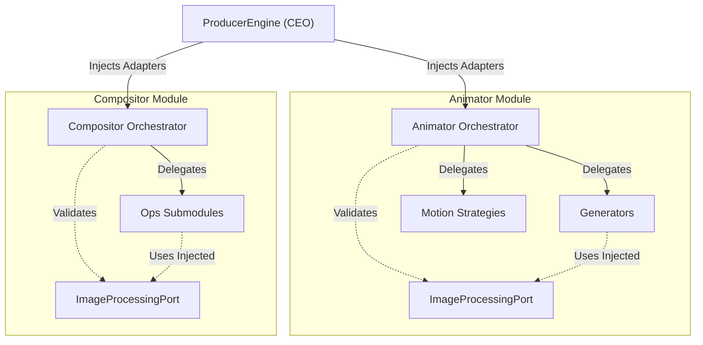

# Architecture: Orchestration & Modular Purity

This document explains the core design pattern used in the engine: **Three-Level Orchestration** and **Component Purity** (Blind Submodules).

---

## 1. The Core Philosophy: "Blind Logic"

In our Hexagonal Architecture, Domain Logic (Submodules) must remain **Pure** and **Blind**.

### The Rules of Blind Logic
1.  **No Knowledge of Infrastructure**: A submodule (`core`, `generators`, `strategies`, `ops`) never imports `adapters`.
2.  **No Knowledge of Interfaces (Ideally)**: A submodule should not even strictly depend on `Ports` if possible. It should depend on **Arguments**.
3.  **No Knowledge of Peers**: A submodule does not know about other submodules. It is a "Leaf Node".

### Example: "Blind" Mask Generator
**Bad (Coupled):**
```python
# generators/mask_generator.py
from ...ports import ImageProcessingPort # Hard dependency

def generate(path):
    adapter = ImageProcessingPort() # Validation logic mixed with business logic
    # ... logic ...
```

**Good (Blind & Pure):**
```python
# generators/mask_generator.py
from typing import Any

def generate(path, image_processor: Any): 
    # I don't know WHAT image_processor is. 
    # I just know if I call .draw_ellipse() on it, it works.
    image_processor.draw_ellipse(...)
```

---

## 2. Three-Level Orchestration

To manage these "Blind" components, we use a hierarchy of Orchestrators.

### Level 1: The Staff (Submodules)
*   **Role**: Expert Technicians.
*   **Responsibility**: Do the math, process the pixels, calculate the curves.
*   **Knowledge**: Zero. They wait to be told what to do and what tools to use.
*   **Location**: `domain/modules/animator/{core, generators, motion}`

### Level 2: The Manager (Module Orchestrator)
*   **Role**: Divison Manager.
*   **Responsibility**:
    *   **Facade**: Provide a simple API for the module (e.g., `create_animator()`).
    *   **Wiring**: Connect "Staff" with "Tools" (Inject Ports into Submodules).
    *   **Validation**: Ensure inputs are correct before asking Staff to work.
*   **Knowledge**: Knows about Ports, Knows about Staff. Does NOT know about other Modules (e.g., Compositor).
*   **Location**: `domain/modules/animator/animator_orchestrator.py`

### Level 3: The CEO (System Engine)
*   **Role**: System Coordinator.
*   **Responsibility**:
    *   **Lifecycle**: Load Project -> Plan -> Execute.
    *   **Inter-Department Communication**: Pass data from Animator to Compositor.
    *   **Composition Root**: The place where Physical Adapters are finally injected.
*   **Knowledge**: Knows Everything (All Modules, All Ports).
*   **Location**: `domain/core/engine.py`

---

## 3. Visual Flow



## 4. Benefit: Why do this?

1.  **Testing is Trivial**: You can test `Generators` by passing *anything* that looks like a processor (Mock). No complex setup.
2.  **Swappable Backend**: Changing from Pillow to OpenCV? The Submodules don't change. Only the Orchestrator injects a different object.
3.  **Fail Fast**: Orchestrators catch missing dependencies early, preventing weird runtime errors deep in the math logic.
