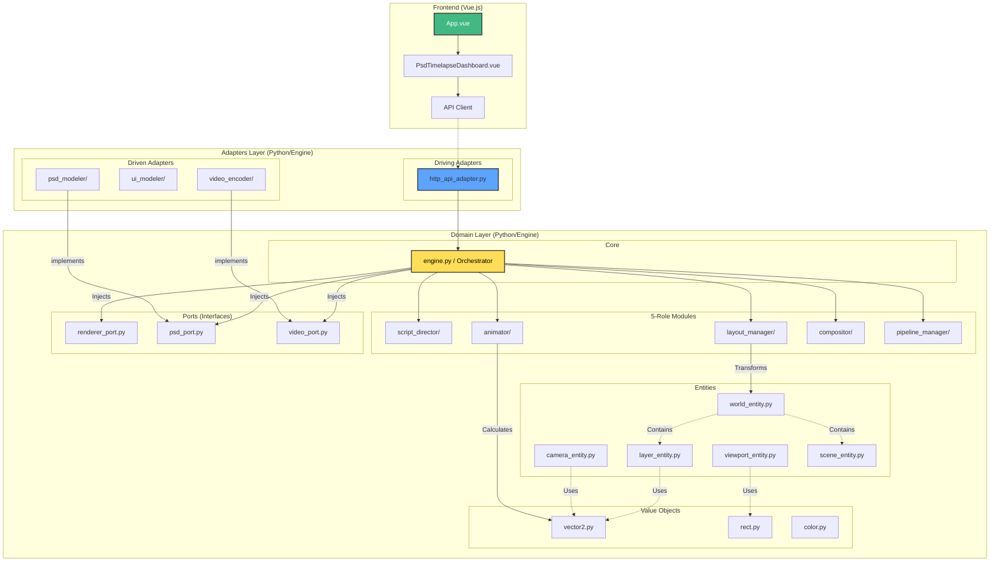

# Project Architecture Map

## Visual Dependency Graph

---

## Overview

This project follows a **Hexagonal Architecture (Ports & Adapters)** pattern, hosted in `engine/src`.

---

## 1. Frontend Layer (`web/src`)

**Tech Stack:** Vue.js 3, TypeScript.

---

## 2. Domain Layer (`engine/src/domain`)

**Core Business Logic** - Framework agnostic, pure Python.

### 2.1 Core Orchestrator
| File | Responsibility |
|------|----------------|
| `core/engine.py` | Central coordinator, provides high-level API |

### 2.2 Entities (Domain Objects)
| File | Responsibility |
|------|----------------|
| `entities/world_entity.py` | Infinite canvas with scene graph |
| `entities/camera_entity.py` | Virtual camera (pan, zoom) |
| `entities/viewport_entity.py` | Output resolution and presets |
| `entities/layer_entity.py` | Individual layer with action hints |
| `entities/scene_entity.py` | Layer hierarchy and iteration |
| `entities/action_entity.py` | Base class for animation actions |
| `entities/smart_action_entity.py` | AI-enhanced action entity |
| `entities/asset_entity.py` | External asset reference |
| `entities/document_entity.py` | Represents the source document (PSD) |
| `entities/timeline_entity.py` | Chronological sequence of actions |

### 2.3 Value Objects (`value_objects/`)

#### Geometry (`value_objects/geometry/`)
| File | Responsibility |
|------|----------------|
| `vector_value.py` | 2D Vector math operations |
| `rect_value.py` | Axis-Aligned Bounding Box (Rect) logic |
| `transform2d_value.py` | Matrix/Affine transformation data |
| `dimensions_value.py` | Width/Height dimension pairs |
| `scale_value.py` | Scaling factors (x, y) |

#### Visual (`value_objects/visual/`)
| File | Responsibility |
|------|----------------|
| `color_value.py` | RGBA color representation |
| `blend_mode_value.py` | Blend mode enums (Normal, Multiply, etc.) |
| `opacity_value.py` | 0-255 or 0.0-1.0 opacity wrapper |
| `resolution_value.py` | Screen/Canvas resolution settings |
| `border_value.py` | Border styles and widths |
| `orientation_value.py` | Landscape/Portrait orientation |
| `video_constants_value.py` | Common video standard constants |

#### Timing (`value_objects/timing/`)
| File | Responsibility |
|------|----------------|
| `time_range_value.py` | Start/End time intervals |
| `duration_value.py` | Time span representation |
| `frame_rate_value.py` | FPS handling (24, 30, 60fps) |
| `progress_value.py` | 0.0-1.0 progress tracking |

#### Animation (`value_objects/animation/`)
| File | Responsibility |
|------|----------------|
| `easing_curve_value.py` | Bézier control points for easing |
| `layer_anim_state.py` | Animation state of a layer at t |
| `render_state_value.py` | Computed render properties |
| `action_type_value.py` | Enum for Action types (Linear, Bezier) |
| `brush_path_type_value.py` | Brush path variants |
| `brush_tool_value.py` | Usage of specific brush tools |
| `director_profile_value.py` | Profile for directing strategies |
| `layer_classification_value.py` | Results of layer analysis |
| `path_direction_value.py` | Direction vectors for paths |
| `sequencing_strategy_value.py` | Strategies for ordering actions |
| `timing_constants.py` | Standard timing constants |

#### Resource (`value_objects/resource/`)
| File | Responsibility |
|------|----------------|
| `file_path_value.py` | Validated system file paths |
| `media_output_path_value.py` | Render target paths |
| `memory_limit_value.py` | RAM usage constraints |
| `worker_count_value.py` | Concurrency settings |
| `batch_size_value.py` | Processing batch sizes |
| `render_output_type_value.py` | Output format enums (MP4, GIF) |

#### Analysis (`value_objects/analysis/`)
| File | Responsibility |
|------|----------------|
| `layer_analysis_value.py` | Data object for layer analysis results |
| `classification_result_value.py` | Outcomes of classification attempts |

#### Configs (`value_objects/configs/`)
| File | Responsibility |
|------|----------------|
| `pipeline_config_value.py` | Overall pipeline configuration |
| `media_output_config_value.py` | Output encoding settings |
| `render_pipeline_config.py` | Specific render pass settings |
| `animator_config_value.py` | Animation engine settings |
| `compositor_config_value.py` | Compositor engine settings |
| `layout_config_value.py` | Layout engine settings |
| `producer_config_value.py` | High-level producer settings |
| `script_director_config_value.py` | Script planning settings |
| `layer_render_config_value.py` | Per-layer render settings |

#### Compositor VOs (`value_objects/compositor/`)
| File | Responsibility |
|------|----------------|
| `composite_layer_value.py` | A layer prepared for composition |
| `composite_frame_value.py` | A full frame prepared for composition |
| `cached_layer_value.py` | Data for caching layers |
| `cursor_state_value.py` | State of the virtual cursor |
| `cursor_style_value.py` | Visual style of the cursor |
| `layer_type_value.py` | Enum for layer types (Video, Image, Text) |

#### Other VOs
| File | Responsibility |
|------|----------------|
| `manifest/layer_manifest_value.py` | Manifest entry for a layer |
| `manifest/compositor_manifest_value.py` | Manifest entry for composition |
| `io/render_manifest.py` | IO Render manifest |
| `pipeline/pipeline_state.py` | Current state of the pipeline |

### 2.5 5-Role Modules

#### Script Director (`modules/script_director/`)
| File | Responsibility |
|------|----------------|
| `script_orchestrator.py` | **FACADE**: Main orchestrator for script planning |
| `analysis/action_classifier_module.py` | Determines `ActionType` (Drag/Brush) for a layer |
| `analysis/layer_analyzer_module.py` | Analysis of layer structure and hierarchy |
| `analysis/layer_classifier_module.py` | Heuristics engine for layer classification |
| `planners/timeline_planner_module.py` | Standard logic for sequencing actions |
| `planners/smart_timeline_planner_module.py` | Advanced planning strategies (staggered, etc.) |
| `generators/script_generator_module.py` | Generates final script output |
| `generators/manifest_generator_module.py` | Generates render manifests |

#### Layout Manager (`modules/layout_manager/`)
| File | Responsibility |
|------|----------------|
| `layout_orchestrator.py` | **FACADE**: Main orchestrator for layout |
| `coordinate_mapper_module.py` | Transforms coordinates between World and Viewport |

#### Animator (`modules/animator/`)
| File | Responsibility |
|------|----------------|
| `animator_orchestrator.py` | **FACADE**: Main orchestrator for animation |
| `core/animator_controller_module.py` | Manages state transitions for layers |
| `motion/bezier_solver_module.py` | Cubic Bézier math for smooth motion paths |
| `motion/path_generator_module.py` | Generates Drag and Brush motion paths |
| `generators/layer_state_generator_module.py` | Generates frame-by-frame layer states |
| `generators/mask_generator_module.py` | Creates reveal masks for brush effects |
| `io/layer_io_module.py` | Handles input/output state for layers |
| `io/layer_hold_module.py` | Logic for holding layer state |
| `strategies/brush_strategy_module.py` | Strategy for brush animation |
| `strategies/drag_strategy_module.py` | Strategy for drag and drop animation |

#### Compositor (`modules/compositor/`)
| File | Responsibility |
|------|----------------|
| `compositor_orchestrator.py` | **FACADE**: Main orchestrator for composition |
| `orchestrators/compositor_module.py` | Core frame composition logic |
| `orchestrators/layer_compositor_module.py` | Logic for blending individual layers |
| `orchestrators/viewport_compositor_module.py` | Viewport-aware composition logic |
| `ops/psd_composition_module.py` | Operation: Flattening PSD layers |
| `ops/velocity_map_module.py` | Operation: calculating motion blur maps |
| `ops/viewport_centered_module.py` | Operation: Centering content in viewport |
| `ops/render_states_composition_module.py` | Operation: Composing based on state |
| `ops/blur_module.py` | Applies Gaussian blur effects |
| `ops/composite_module.py` | Basic image composite operations |
| `ops/opacity_module.py` | Protocol for opacity application |
| `ops/subpixel_module.py` | Subpixel rendering adjustments |
| `ops/viewport_frame_module.py` | Viewport frame calculations |
| `ops/viewport_layer_module.py` | Layer-within-viewport positioning |
| `services/cursor_render_service.py` | Renders the virtual cursor overlay |
| `services/layer_cache_module.py` | Caching system for rendered layers |
| `services/layer_service.py` | Layer retrieval and management service |

#### Pipeline Manager (`modules/pipeline_manager/`)
| File | Responsibility |
|------|----------------|
| `orchestrator/director_engine_module.py` | **FACADE**: DirectorEngine - main loop |
| `orchestrator/pipeline_orchestrator.py` | High-level pipeline coordination |
| `orchestrator/pipeline_manager_module.py` | Pipeline state management |
| `orchestrator/layer_render_pipeline_module.py` | Specific pipeline for layer rendering |
| `orchestrator/render_orchestrator_module.py` | Render pass orchestration |
| `orchestrator/render_pipeline_module.py` | Standard render pipeline implementation |
| `rendering/frame_renderer_module.py` | Renders individual frames |
| `rendering/parallel_renderer_module.py` | Parallel rendering strategy |
| `rendering/layer_renderer_service_module.py` | Service for rendering layers |
| `rendering/media_output_service_module.py` | Handles video/media output |
| `rendering/gpu_strategy_module.py` | GPU-based rendering strategy |
| `rendering/cpu_strategy_module.py` | CPU-based rendering strategy |
| `rendering/optimized_strategy_module.py` | Optimized rendering strategy |
| `rendering/layer_composition_module.py` | Composite layer logic in pipeline |
| `rendering/layer_animation_service_module.py` | Animation state service |
| `rendering/gpu_backend_module.py` | Direct GPU backend interface |
| `ui/progress_tracker_module.py` | Tracks and reports render progress |
| `ui/cursor_overlay_module.py` | Handles cursor overlay in pipeline |
| `ui/ui_helper_module.py` | CLI/UI helper utilities |

---

## 3. Adapters Layer (`engine/src/adapters`)

### 3.1 Driven Adapters (Infrastructure)

#### PSD Modeler (`driven/psd_modeler/`)
| File | Responsibility |
|------|----------------|
| `psdtools_parser_adapter.py` | Parsing PSDs using `psd-tools` library |

#### Video Encoder (`driven/video_encoder/`)
| File | Responsibility |
|------|----------------|
| `moviepy_encoder_adapter.py` | Video export using `MoviePy` |
| `ffmpeg_pipe_encoder.py` | Direct FFmpeg piping for speed |
| `ffmpeg_command_factory.py` | Generates CLI arguments for FFmpeg |
| `nvenc_encoder_adapter.py` | Hardware accelerated (NVIDIA) encoding |
| `nvenc_capability_module.py` | Checks for GPU support |
| `exr_output_adapter.py` | High-fidelity EXR image sequence output |
| `alpha_composite_module.py` | Alpha compositing utility for encoder |
| `layer_video_adapter.py` | Video adapter for layer sources |
| `mp4_encoder_adapter.py` | Dedicated MP4 format encoder |
| `zerocopy_encoder.py` | Zero-copy encoding optimization |

#### UI Modeler (`driven/ui_modeler/`)
| File | Responsibility |
|------|----------------|
| `pillow_modeler_adapter.py` | Main entry point for UI overlay rendering |
| `pillow_header_adapter.py` | Renders top menu bar |
| `pillow_toolbars_adapter.py` | Renders side toolbars |
| `pillow_layers_panel_adapter.py` | Renders dynamic layers panel |
| `pillow_canvas_adapter.py` | Renders the canvas background |
| `pillow_base_adapter.py` | Base class for UI components |
| `pillow_constants_adapter.py` | UI layout constants and styles |

#### Other Infrastructure
| File | Responsibility |
|------|----------------|
| `cache/in_memory_cache_adapter.py` | In-memory caching implementation |
| `filesystem/local_file_system_adapter.py` | Local file I/O operations |
| `filesystem/local_asset_provider_adapter.py` | Asset loading from local disk |
| `image/pillow_image_adapter.py` | Pillow-based image manipulation |
| `logging/std_logger_adapter.py` | Standard Python logging adapter |
| `notifications/console_notification_adapter.py` | Console output for notifications |
| `renderers/pillow_renderer_adapter.py` | Main pillow renderer |
| `system/system_time_adapter.py` | Time provider |

### 3.2 Driving Adapters (Entry Points)
| File | Responsibility |
|------|----------------|
| `driving/http/http_api_adapter.py` | FastAPI routes for frontend |

---

## 4. Tests (`engine/src/domain/modules/pipeline_manager/scenario`)
| Folder | Purpose |
|--------|---------|
| `integration/` | Full pipeline integration tests |
| `visual/` | Visual regression tests |
| `unit/` | Unit logic tests |

